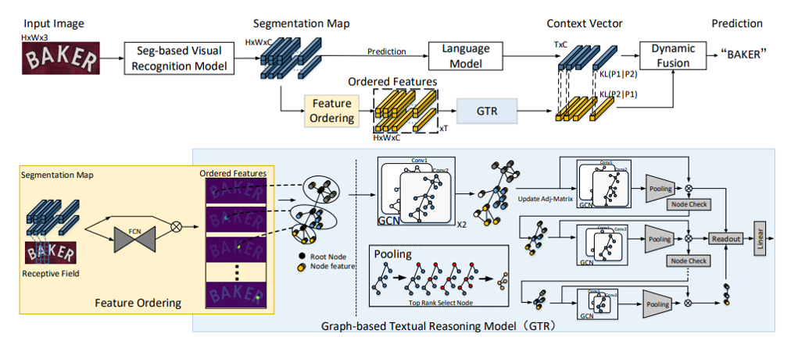

# Overview

## Introduction
This is the official implementation of the AAAI 22 accepted paper : Visual Semantics Allow for Textual Reasoning Better in Scene Text Recognition. [paper](https://arxiv.org/abs/2112.12916) 

[comment]: <> "This code is based on the [aster.pytorch]&#40;https://github.com/ayumiymk/aster.pytorch&#41;, we sincerely thank ayumiymk for his awesome repo and help."

## Abstract
Existing Scene Text Recognition (STR) methods typically use a language model to optimize the joint probability of the 1D character sequence predicted by a visual recognition (VR) model, which ignore the 2D spatial context of visual semantics within and between character instances, making them not generalize well to arbitrary shape scene text. To address this issue, we make the first attempt to perform textual reasoning based on visual semantics in this paper. Technically, given the character segmentation maps predicted by a VR model, we construct a subgraph for each instance, where nodes represent the pixels in it and edges are added between nodes based on their spatial similarity. Then, these subgraphs are sequentially connected by their root nodes and merged into a complete graph. Based on this graph, we devise a graph convolutional network for textual reasoning (GTR) by supervising it with a cross-entropy loss. GTR can be easily plugged in representative STR models to improve their performance owing to better textual reasoning. Specifically, we construct our model, namely S-GTR, by paralleling GTR to the language model in a segmentation-based STR baseline,
which can effectively exploit the visual-linguistic complementarity via mutual learning. S-GTR sets new state-of-the-art on six challenging STR benchmarks and generalizes well to multi-linguistic datasets. 


## Framework

[comment]: <> "![]&#40;D:\heyue43\work\accept-paper\1S-GTR\lib\img\motivation.png&#41;"




## How to use
### Env
```
PyTorch == 1.1.0 
torchvision == 0.3.0
fasttext == 0.9.1
```
Details can be found in requirements.txt

### Train
##### Prepare your data
-  Download the  training set (bin) from [here(soon update)]()
- Download the pretrained Seg-baseline visual recognition model (bin) from [here(soon update)]()
- Update the path in the lib/tools/create_all_synth_lmdb.py
- Run the lib/tools/create_all_synth_lmdb.py
- Note: it may result in large storage space, you can modify the datasets/dataset.py to generate the word embedding in an online way

##### Run
- Update the path in train.sh, then
```
sh train.sh
```

### Test
- Update the path in the test.sh, then
```
sh test.sh
```

## Experiments
### Evaluation results on benchmarks
* You can downlod the benchmark datasets from [BaiduYun](https://pan.baidu.com/s/1Z4aI1_B7Qwg9kVECK0ucrQ) (key: nphk) shared by clovaai in this [repo](https://github.com/clovaai/deep-text-recognition-benchmark).

|Methods |TrainData|     Checkpoint  | IIIT5K | SVT  | IC13 | SVTP  | IC15 |  CUTE  |
|:--------:|:--------:|:-----------------:|:------:|:----------:|:--------:|:------:|:----------:|:---:|
|SegBaseline| ST+MJ |[OneDrive]()() [BaiduYun]()(key: )  |94.2 |90.8 |93.6 |84.3 |82.0 |87.6|
|S-GTR| ST+MJ |[OneDrive]() [BaiduYun]()(key: ) |95.8 | 94.1 | 96.8 | 87.9|84.6| 92.3 |
|S-GTR| ST+MJ+R |[OneDrive]() [BaiduYun]()(key: )  |97.5 |95.8 |97.8 |90.6 |87.3 |94.7|

<<<<<<< HEAD
### Evaluate S-GTR with different settings  
* Investigate  the  impact  of  different  modules in  S-GTR. 
=======
### Evalution S-GTR with different settings  
* investigate  the  impact  of  different  modulesin  S-GTR, 
>>>>>>> e52b3783f9991346171892fa44fad118c2a5dd55

|VRM|LM|GTR| IIIT5K | SVT  | IC13 | SVTP  | IC15 |  CUTE  |
|:------:|:------:|:------: |:------:|:-----:|:----------:|:----:|:-----:|:------:|
|√ | | |91.8 |86.6 |91.1 |79.8 |77.7 |84.8|
|√ |√ | |94.2 |90.8 |93.6 |84.3 |82.0 |87.6|
|√ | |√ |94.0 |91.2 |94.8 |85.0 |82.8 |88.4 |
|√ |√ |√ | 95.1 |93.2 |95.9 |86.2 |84.1 |91.3|
<<<<<<< HEAD
### Plugging GTR in different STR baselines 
 *  Plug GTR module into four representative types of STR methods.
=======
### Plug in different STR baselines 
 * Directly use word embedding from the pre-trained LM during training and inference.
>>>>>>> e52b3783f9991346171892fa44fad118c2a5dd55

|Methods| IIIT5K | SVT  | IC13 | SVTP  | IC15 |  CUTE  |
|:------:|:------:|:-----:|:---------:|:----------:|:----:|:-----:|
|GTR+CRNN|  87.6 | 82.1 | 90.1 | 68.1 | 68.2 | 78.1   |
|GTR+TRBA|93.2 | 90.1 | 94.0 | 80.7 | 76.0 | 82.1|
|GTR+SRN| 96.0 | 93.1 | 96.1 | 87.9 | 83.9 | 90.7 |
|GTR+PRENBaseline| 6.1 | 94.1 | 96.6 | 88.0 | 85.3 | 92.6|
|GTR+ABINet-LV| 96.8 | 94.8  | 97.7  | 89.6   | 86.9  | 93.1   |


### Issue
<<<<<<< HEAD
1. The pretrain model will be uploaded  and the training code for MT adative framework will be updated soon.
2. This code is only for S-GTR, and other pluggin models will be updated soon. 
=======
1. The pretrain model will soon upload， and the training for MT adative framework will soon update.
2. This is code only for S-GTR, and other pluggin model will submit recently. 
>>>>>>> e52b3783f9991346171892fa44fad118c2a5dd55

## Citation
```
@article{shi2016end,
  title={An end-to-end trainable neural network for image-based sequence recognition and its application to scene text recognition},
  author={Shi, Baoguang and Bai, Xiang and Yao, Cong},
  journal={IEEE Transactions on Pattern Analysis and Machine Intelligence},
  volume={39},
  number={11},
  pages={2298--2304},
  year={2016},
  publisher={IEEE}
}

@inproceedings{yan2021primitive,
  title={Primitive Representation Learning for Scene Text Recognition},
  author={Yan, Ruijie and Peng, Liangrui and Xiao, Shanyu and Yao, Gang},
  booktitle={Proceedings of the IEEE/CVF Conference on Computer Vision and Pattern Recognition},
  pages={284--293},
  year={2021}
}

@inproceedings{baek2019wrong,
  title={What is wrong with scene text recognition model comparisons? dataset and model analysis},
  author={Baek, Jeonghun and Kim, Geewook and Lee, Junyeop and Park, Sungrae and Han, Dongyoon and Yun, Sangdoo and Oh, Seong Joon and Lee, Hwalsuk},
  booktitle={Proceedings of the IEEE/CVF International Conference on Computer Vision},
  pages={4715--4723},
  year={2019}
}

@inproceedings{yu2020towards,
  title={Towards accurate scene text recognition with semantic reasoning networks},
  author={Yu, Deli and Li, Xuan and Zhang, Chengquan and Liu, Tao and Han, Junyu and Liu, Jingtuo and Ding, Errui},
  booktitle={Proceedings of the IEEE Conference on Computer Vision and Pattern Recognition},
  pages={12113--12122},
  year={2020},
  publisher={IEEE},
  address ={Seattle, WA, USA}
}

@article{fang2021read,
  title={Read Like Humans: Autonomous, Bidirectional and Iterative Language Modeling for Scene Text Recognition},
  author={Fang, Shancheng and Xie, Hongtao and Wang, Yuxin and Mao, Zhendong and Zhang, Yongdong},
  journal={arXiv preprint arXiv:2103.06495},
  year={2021}
}
```
